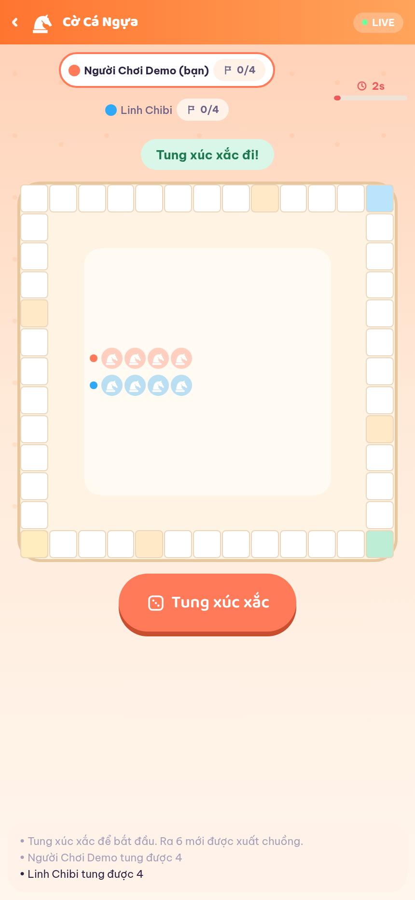
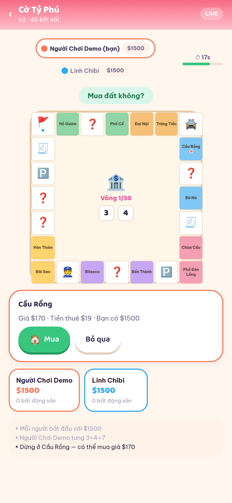

# 🎮 Hago — Social Mini-Game Platform

Nền tảng social mini-game **mobile-first** theo phong cách **chibi**: chơi game casual cùng bạn bè,
kết bạn, chat, leo rank, làm nhiệm vụ và sưu tầm cosmetic.

Triển khai đầy đủ theo PRD *Social Mini-Game Platform v1.0*: 7 game launch, realtime
server-authoritative, economy có audit, admin panel và analytics.

> Tác giả: **thanhtinz** · Giấy phép: MIT

---

## 📸 Ảnh màn hình

| Đăng nhập | Trang chủ | Kho game |
|---|---|---|
|  |  |  |

| Bạn bè | Chat | Cửa hàng |
|---|---|---|
|  |  |  |

| Hồ sơ | Nhiệm vụ | Bảng xếp hạng |
|---|---|---|
|  |  |  |

### 7 mini game

| Cờ Caro | Bắn Tàu | Ô Ăn Quan |
|---|---|---|
|  |  |  |

| Cờ Cá Ngựa | Cờ Tỷ Phú | Sheep Battle |
|---|---|---|
|  |  |  |

| Ma Sói | Tìm trận | Kết quả |
|---|---|---|
|  |  |  |

### Admin Dashboard

| Tổng quan | Người dùng |
|---|---|
|  |  |

| Live Ops | Kiểm duyệt |
|---|---|
|  |  |

Toàn bộ ảnh nằm trong [`docs/screenshots/`](docs/screenshots).

---

## 🧱 Kiến trúc

Modular monolith cho MVP, tách rõ realtime gateway để scale độc lập về sau.

```
hago/
├── packages/shared/     TypeScript thuần: domain model + 7 game engine + progression
│   └── src/games/       caro, battleship, oanquan, sheep, monopoly, ludo, werewolf
├── apps/server/         Node.js + Express + Socket.IO + SQLite (better-sqlite3)
│   ├── src/routes/      REST: auth, users, social, economy, progress, admin
│   ├── src/services/    users, social, economy, quests, notifications, analytics
│   ├── src/realtime/    rooms, matchmaking, match runtime, gateway
│   └── scripts/bot.mjs  Bot người chơi cho dev/test/demo
├── apps/mobile/         React Native + Expo (iOS/Android/Web), expo-router
│   └── src/games/       Bàn chơi riêng cho từng game
└── apps/admin/          React + Vite — bảng điều khiển vận hành
```

**Nguyên tắc cốt lõi**: client chỉ gửi *intent*, server xác thực và giữ authoritative state.
Client không bao giờ nhận thông tin ẩn (vị trí tàu đối thủ, vai Ma Sói, kết quả xúc xắc trước khi tung).

```
Mobile (RN/Expo) ──REST──> Express API ──> SQLite (WAL)
        └────WebSocket────> Socket.IO Gateway
                                 ├── Room registry
                                 ├── Matchmaking (Elo window nới dần)
                                 └── Match runtime ──> Game Engines (pure)
```

---

## 🕹️ Danh mục game

| Game | Người chơi | Thể loại | Chế độ | Điểm kỹ thuật |
|---|---|---|---|---|
| Cờ Caro | 2 | Board strategy | Normal/Ranked/Custom | Bàn cấu hình 9–19, luật đúng-5-quân |
| Bắn Tàu | 2 | Turn-based | Normal/Ranked/Custom | Hidden board, trúng được bắn tiếp |
| Ô Ăn Quan | 2 | Board dân gian | Normal/Ranked/Custom | Rải, ăn dây, rải lại khi hết dân |
| Sheep Battle | 2–4 | Realtime casual | Normal/Ranked/Custom | Tick 5Hz, cooldown di chuyển, húc rơi cừu |
| Cờ Tỷ Phú | 2–4 | Board/economy | Normal/Custom | Bàn 24 ô, độc quyền x2 tô, tù, phá sản |
| Cờ Cá Ngựa | 2–4 | Board casual | Normal/Ranked/Custom | Ô an toàn, đá ngựa, ra 6 đi tiếp |
| Ma Sói | 4–16 | Social deduction | Normal/Custom | State machine đêm/ngày/vote, 6 vai |

Mỗi engine tuân theo `GameEngine` interface trong `packages/shared/src/engine.ts`:

```ts
interface GameEngine<S, C> {
  init(players, config, rng): S;
  apply(state, playerId, type, payload, rng): ApplyResult<S>;
  tick?(state, now, rng): ApplyOk<S>;      // game realtime
  timeout?(state, rng): ApplyOk<S>;         // auto-play khi hết giờ
  view(state, viewerId): unknown;           // redact thông tin ẩn
  results(state): EngineResultRow[];
  deadline(state): number | null;
}
```

Thêm game mới = viết 1 file engine + 1 component bàn chơi. Toàn bộ account, lobby,
matchmaking, economy và realtime dùng chung.

---

## ✨ Tính năng đã hoàn thiện

**Tài khoản & hồ sơ** — đăng ký/đăng nhập JWT, quản lý phiên đăng nhập, avatar chibi
sinh tự động, level/XP, rank Bronze→Master, thống kê theo từng game.

**Social** — kết bạn hai chiều, chặn, chat 1-1 và chat phòng, sticker, presence online,
báo cáo người chơi, lọc từ ngữ tục tĩu, rate limit chống spam.

**Lobby & matchmaking** — phòng public/private có mã 6 ký tự, mật khẩu, kick, mời bạn,
sẵn sàng; Quick Match ghép theo game + mode + region, cửa sổ Elo nới dần theo thời gian chờ.

**Realtime** — Socket.IO, idempotency theo `action_id`, version state tăng dần,
reconnect tự động khôi phục ván đang chơi, grace period 60s trước khi xử thua AFK.

**Progression** — Elo với K giảm theo rank, XP/Coin có daily cap chống farm, first-win
bonus, nhiệm vụ ngày/tuần, thành tựu, bảng xếp hạng tổng và theo game.

**Economy** — 19 cosmetic (khung, danh hiệu, nền, bong bóng chat, emote, hiệu ứng, theme bàn cờ),
Coin/Diamond/Season Token, mọi thay đổi số dư ghi transaction bất biến trong SQL transaction.

**Admin** — dashboard KPI, quản lý user, theo dõi phòng/trận live, CRUD vật phẩm và
nhiệm vụ/sự kiện, xử lý báo cáo, audit log, phễu analytics.

---

## 🚀 Chạy dự án

```bash
# 1. Cài dependencies
npm install                       # workspaces: shared, server, admin
npm install --prefix apps/mobile  # Expo có node_modules riêng

# 2. Build package dùng chung
npm run build:shared

# 3. Chạy server (http://localhost:4000)
npm run dev:server

# 4. Chạy app mobile
cd apps/mobile && npx expo start
#   → nhấn 'a' mở Android, 'i' mở iOS, 'w' mở web

# 5. Chạy admin (http://localhost:5174)
npm run dev:admin
```

Tài khoản có sẵn: `demo / demo123` (người chơi) và `admin / admin123` (quản trị),
kèm 8 tài khoản demo khác để test social.

### Build production

```bash
npm run build -w @hago/shared
npm run build -w @hago/server
npm run build -w @hago/admin          # served tại /admin của server
cd apps/mobile && npx expo export --platform web
cd apps/mobile && eas build -p android   # build APK/AAB native
```

### Bot cho dev / demo

```bash
node apps/server/scripts/bot.mjs --idle --count 6         # giữ bạn bè online
node apps/server/scripts/bot.mjs --game caro --count 1    # ghép trận với bạn
node apps/server/scripts/bot.mjs --game ludo --count 3 --loop
```

### Biến môi trường

| Biến | Mặc định | Ý nghĩa |
|---|---|---|
| `PORT` | `4000` | Cổng server |
| `JWT_SECRET` | dev secret | **Bắt buộc đổi khi lên production** |
| `DB_FILE` | `data/hago.db` | Đường dẫn SQLite |
| `CORS_ORIGIN` | `*` | Origin cho phép |
| `RECONNECT_GRACE_MS` | `60000` | Thời gian chờ reconnect |
| `DAILY_XP_CAP` | `3000` | Trần XP mỗi ngày |
| `EXPO_PUBLIC_API_URL` | tự dò | URL API cho app mobile |

---

## 🎨 Nguồn asset

| Loại | Nguồn | Giấy phép |
|---|---|---|
| Avatar chibi | [DiceBear](https://github.com/dicebear/dicebear) — render SVG server-side, 10 bộ style | MIT |
| Font tiêu đề | [Baloo 2](https://github.com/googlefonts/baloo) qua `@expo-google-fonts` | OFL |
| Font nội dung | [Be Vietnam Pro](https://github.com/bettergui/BeVietnamPro) — hỗ trợ tiếng Việt đầy đủ | OFL |
| Icon & minh hoạ | Emoji hệ thống | — |
| Khung, nền, bàn cờ, hiệu ứng | **CSS/gradient tự vẽ** trong `src/theme.ts` | — |

Không phụ thuộc asset nhị phân nào: avatar sinh theo seed, cosmetic vẽ bằng gradient,
nên app nhẹ và mọi item mới chỉ cần một dòng cấu hình màu.

---

## 🔒 Bảo mật & chống gian lận

- Server authoritative tuyệt đối — client gửi intent, không gửi kết quả.
- Thông tin ẩn không rời server: `view(state, viewerId)` lọc theo từng người xem.
- Xúc xắc và phân vai sinh bằng RNG có seed lưu cùng match → replay/audit được.
- `action_id` chống double-submit khi mạng chập chờn.
- Rate limit REST (đăng nhập), WebSocket (chat 12/10s, action 25/s).
- Số dư chỉ đổi qua `mutateCurrency()` → luôn có transaction + audit log.
- JWT có session revoke; ban/suspend thu hồi toàn bộ phiên ngay lập tức.

---

## 🗺️ Trạng thái theo PRD

| Hạng mục | Trạng thái |
|---|---|
| Authentication, Profile, Avatar | ✅ |
| Friend, Block, Text chat 1-1 & room | ✅ |
| Home, game catalog, Quick Match | ✅ |
| Lobby, Room, Invite, room code | ✅ |
| 7 game launch (Normal/Ranked/Custom) | ✅ |
| XP, Coin, Rank, Achievement, Quest | ✅ |
| Shop, Inventory, Payment (mô phỏng) | ✅ |
| Notification in-app | ✅ |
| Admin Panel + Analytics | ✅ |
| Report/Ban/Mute, profanity filter | ✅ |
| Reconnect + grace period | ✅ |
| Tournament bracket, Battle Pass, Guild | 🔜 Phase 2 |
| Push notification (FCM/APNs) | 🔜 Phase 2 |
| Skill-based MM nâng cao, seasonal rank | 🔜 Phase 2 |

Chi tiết kỹ thuật: [`docs/ARCHITECTURE.md`](docs/ARCHITECTURE.md) · API: [`docs/API.md`](docs/API.md)

---

## ✅ Kiểm thử

```bash
npm test                    # chạy toàn bộ
npm test -w @hago/shared    # 31 test: 7 engine, redact thông tin ẩn, Elo, XP cap
npm test -w @hago/server    # 13 test tích hợp: đăng ký → ghép trận → thưởng → shop → admin
```

Test tích hợp khởi động server thật trên SQLite tạm và điều khiển hai WebSocket client
chơi trọn một ván Caro ranked, kiểm tra: kết quả do server quyết định, Elo bảo toàn tổng,
`action_id` trùng không tính hai lần, lọc từ tục, rate limit chat, không mua trùng vật phẩm,
không claim quest hai lần, RBAC admin và ban thu hồi phiên.
